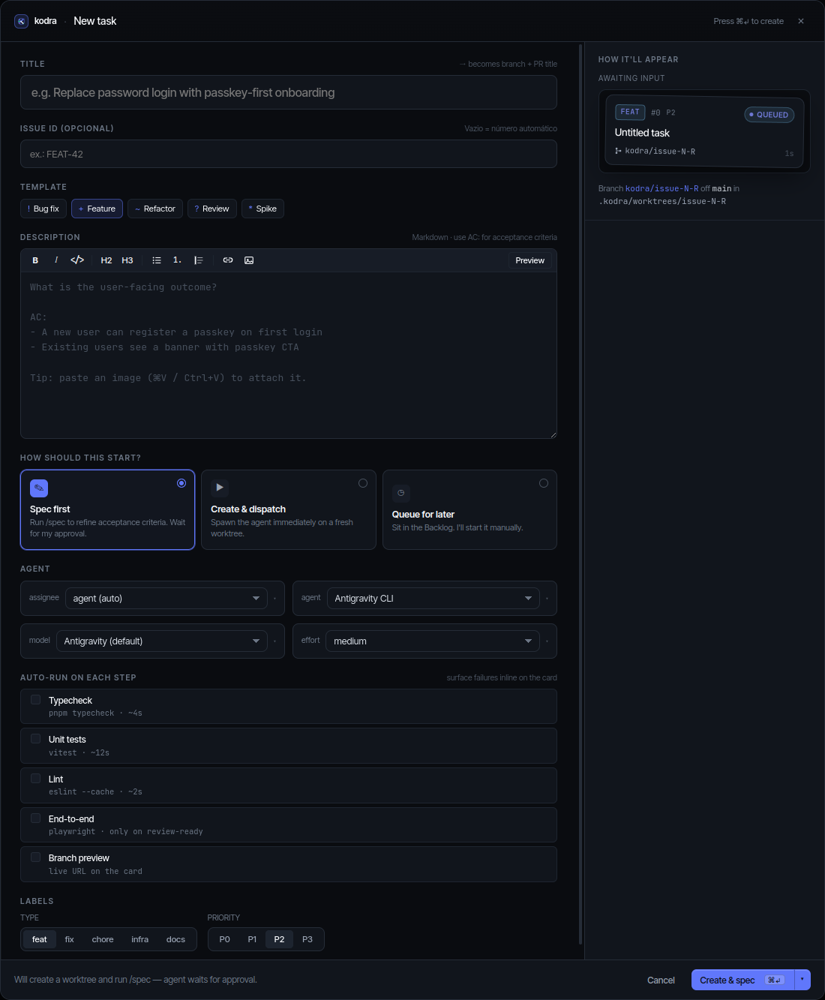
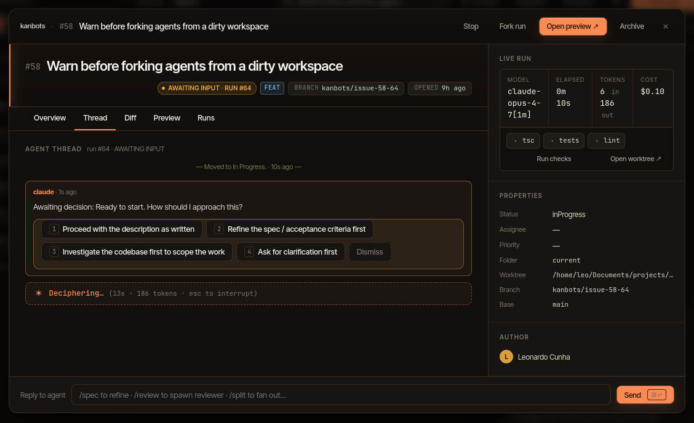

# Getting started with Kodra OSS Desktop

> This is the **OSS desktop edition** — local-first, runs entirely on your
> machine, no account required.

This walks you through installing the desktop app, getting an agent CLI
set up, opening your first workspace, and dispatching an agent run.

## 1. Install

Packaged builds live on the
[Kodra releases page](https://github.com/vitorvaf/kodra/releases).

**Linux / WSL — one line:**

```sh
curl -fsSL https://raw.githubusercontent.com/vitorvaf/kodra/main/scripts/install-linux.sh | bash
```

Installs the latest AppImage to `~/.local/share/kodra/` and exposes it as
`kodra` on `~/.local/bin`. In WSL the UI requires WSLg (built into
Windows 11 and updated Windows 10); on fresh systems without `libfuse2`
the installer uses an extract-and-run wrapper automatically.

Artifact names, if you prefer to download manually:

| Platform | Artifact | Notes |
| --- | --- | --- |
| Linux x64 | `kodra-<version>-linux-x64.AppImage` | `chmod +x` and run, or use the installer above. |
| Linux x64 | `kodra-<version>-linux-x64.tar.xz` | Extract anywhere, run `./kodra`. |
| macOS Apple Silicon | `kodra-<version>-mac-arm64.dmg` | Drag to `/Applications`. See [unsigned-builds](#unsigned-builds). |
| macOS Intel | `kodra-<version>-mac-x64.dmg` | Drag to `/Applications`. See [unsigned-builds](#unsigned-builds). |
| Windows x64 | `kodra-<version>-win-x64.exe` | NSIS installer. See [unsigned-builds](#unsigned-builds). |

The releasing pipeline lives in
[docs/releasing.md](releasing.md); to run from source instead, see
[build-from-source](#build-from-source-macos--windows) below.

### Unsigned builds

Future Kodra binaries are not yet expected to be code-signed (Apple Developer ID and
Windows EV certs are paid; we'll add them when revenue covers it).
First-launch friction is small but real:

**macOS — one-line installer (planned).** A Kodra installer does not yet
exist. Do not use an upstream Kanbots installer as a Kodra install path.

**macOS — manual install (when builds are available).** If you'd rather drag the .dmg yourself,
Gatekeeper will block first launch with one of two messages depending
on your macOS version:

- macOS 14 and earlier: _"Kodra cannot be opened because Apple cannot
  check it for malicious software."_ Right-click the app, choose
  **Open**, then click **Open** again in the prompt.
- macOS 15+ (incl. macOS 26 / Tahoe): _"Kodra is damaged and can't be
  opened. You should move it to the Trash."_ The right-click trick no
  longer works on this wording — you have to clear the quarantine flag
  from a terminal:

  ```sh
  xattr -dr com.apple.quarantine "/Applications/Kodra.app"
  ```

**Windows (when builds are available)** — Microsoft Defender SmartScreen pops up: _"Windows
protected your PC."_ Click **More info → Run anyway**.

After the first launch you don't see these prompts again on the same
machine.

### Build from source (any platform)

If you'd rather run from source, you'll need **Node 20+**, **pnpm 10+**,
and **git**:

```sh
git clone https://github.com/vitorvaf/kanbots.git
cd kanbots
pnpm install
pnpm desktop          # build everything, open Electron
# or, with hot reload:
pnpm desktop:dev
```

## 2. Install Claude Code

Kodra dispatches agents through the **Claude Code** CLI by default. Without
an agent CLI on your `PATH`, the **Dispatch** button will fail.

1. Install from
   <https://docs.claude.com/en/docs/claude-code> (Kodra needs
   Claude Code 1.0+).
2. Sign in once: `claude /login`.
3. Verify: `which claude` should print a path; `claude --version`
   should report a version.

Kodra inherits the environment of whatever launches it, so
authenticate Claude Code in the same shell (or in your shell rc) that
your desktop session inherits from.

### Antigravity CLI (optional)

Install Google's Antigravity CLI (`agy`) and use version 1.1.1 or newer for
piped output:

```sh
curl -fsSL https://antigravity.google/cli/install.sh | bash
```

On Windows PowerShell:

```powershell
irm https://antigravity.google/cli/install.ps1 | iex
```

Authenticate with browser OAuth on first launch. Alternatively, set
`GEMINI_API_KEY` and `modelProvider "gemini"` in
`~/.gemini/antigravity-cli/settings.json`.

> Codex and Antigravity CLI are supported alternatives — install the `codex`
> CLI or `agy` CLI and Kodra will offer them per dispatch. You need at least
> one of `claude`, `codex`, or `agy` available.

## 3. Open Kodra

Launching the app drops you on the **workspace picker**. Browse to
any folder that contains a git repository and click **Open**.

On first open, Kodra will:

1. Resolve the git toplevel via `git rev-parse --show-toplevel`.
2. Create `.kanbots/` next to it (`db.sqlite`, `config.json`,
   `worktrees/`, etc.).
3. Detect a GitHub remote. If `origin` exists, you can pick **GitHub
   mode**; otherwise it falls back to **Local mode**.

You can switch modes later from workspace settings.

### Where things live on disk

```
<your-repo>/
└── .kanbots/
    ├── db.sqlite              # everything: issues, runs, threads, providers
    ├── db.sqlite-wal          # WAL journal (better-sqlite3)
    ├── db.sqlite-shm          # shared memory
    ├── config.json            # workspace mode + defaults
    ├── worktrees/             # per-run git worktrees
    │   └── issue-42-7/
    ├── attachments/           # files dragged into chats / cards
    ├── mcp-runtime/           # transient MCP configs handed to claude
    └── promote/               # staging when promoting a worktree
```

`db.sqlite` is the source of truth for everything except your source
code. Add `.kanbots/` to `.gitignore` — the app prompts to do this on
first open.

Nothing is written outside the workspace folder.

## 4. Add a card and dispatch

1. Click **+ New task** in the top right.
2. Pick a template (Bug fix, Feature, Refactor, Review, Spike), write
   a description, and pick how the card should start:
   - **Spec first** — runs `/spec` on a fresh worktree and waits for
     your approval on refined acceptance criteria before
     implementation.
   - **Create & dispatch** — spawns an agent immediately on a fresh
     worktree.
   - **Queue for later** — sits in Backlog until you start it.
3. Pick the agent CLI (`claude (auto)` defaults to Claude Code; you can
   switch to Codex or Antigravity CLI per dispatch), the model, and the effort.

   

4. In **Local mode** the card lands as a row in `local_issues`. In
   **GitHub mode** it's posted as a real issue on the repo.

### Your first agent run

1. Open the card and click **Dispatch**.
2. Pick an agent identity (Claude Code, Codex, or Antigravity CLI) and a
   model. Confirm.
3. Kodra creates `.kanbots/worktrees/issue-<n>-<runId>/`, branches
   it from your default branch, and spawns the chosen CLI against it.
4. The detail panel switches to the live thread. Every `tool_use` and
   `tool_result` streams in.
5. If the agent asks for permission, a decision card appears. Click
   an option; the run resumes with that choice.
6. When the run finishes, you can:
   - **Branch preview** — start the worktree's dev server and open
     a live URL.
   - **Promote commit** — rebase the worktree's tip onto your branch.
   - **Open draft PR** (GitHub mode only) — push and open a draft PR.
   - **Discard** — remove the worktree and branch.

   

A pre-push hook is installed in every worktree, so even if the agent
runs `git push`, it will fail. Promotion is always an explicit user
step.

## Troubleshooting

### "Dispatch failed: claude not found" (Claude Code not installed)

Kodra couldn't locate the `claude` binary on your `PATH`.

- Check from a terminal: `which claude` should print a path.
- If empty, install Claude Code:
  <https://docs.claude.com/en/docs/claude-code>.
- After installing, sign in once: `claude /login`.
- If `which claude` works in your terminal but the app still fails,
  the desktop launcher is using a different `PATH`. Restart Kodra
  from the same shell where `claude` resolves, or add the install
  directory to your shell rc (e.g. `~/.zshrc`, `~/.bashrc`,
  `~/.config/fish/config.fish`) and log out / back in.

### "Not a git repository" (repo not cloned locally)

Kodra only opens **folders that contain a git repository** — it
runs `git rev-parse --show-toplevel` to find the project root and
creates worktrees relative to it. If the picker rejects a folder:

- Make sure you cloned the repo and picked the cloned folder
  (`git clone https://github.com/<owner>/<repo>`), not a download
  zip.
- If the folder _is_ a clone, run `git status` inside it from a
  terminal to confirm — submodules and shallow clones are fine.
- If you want to start a brand-new project: `git init` in an empty
  folder before pointing Kodra at it.

### "Port 8474 already in use" (dispatcher port conflict)

The local dispatcher binds to port **8474** for streaming agent
output to the renderer. If another process already holds it, agent
runs won't start.

- Find what's holding the port:
  - Linux / macOS: `lsof -i :8474` or `ss -ltnp 'sport = :8474'`.
  - Windows: `netstat -ano | findstr 8474`.
- Often it's a stale Kodra from a previous session. Kill that
  process and relaunch.
- If you need a different port, set `KANBOTS_DISPATCHER_PORT=<port>`
  in the environment Kodra inherits, then relaunch.

## Next steps

- Set up GitHub auth properly: [issues.md](issues.md#github-mode)
- Wire the MCP server into Cursor: [mcp-server.md](mcp-server.md)
- Set per-run cost budgets: [configuration.md](configuration.md#cost-budgets)
- Try parallel runs and Autopilot: [agents.md → Autopilot](agents.md#autopilot)
